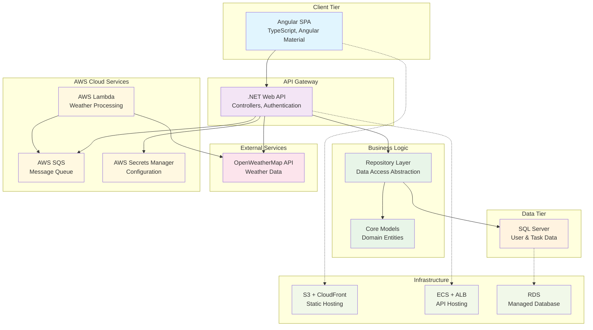
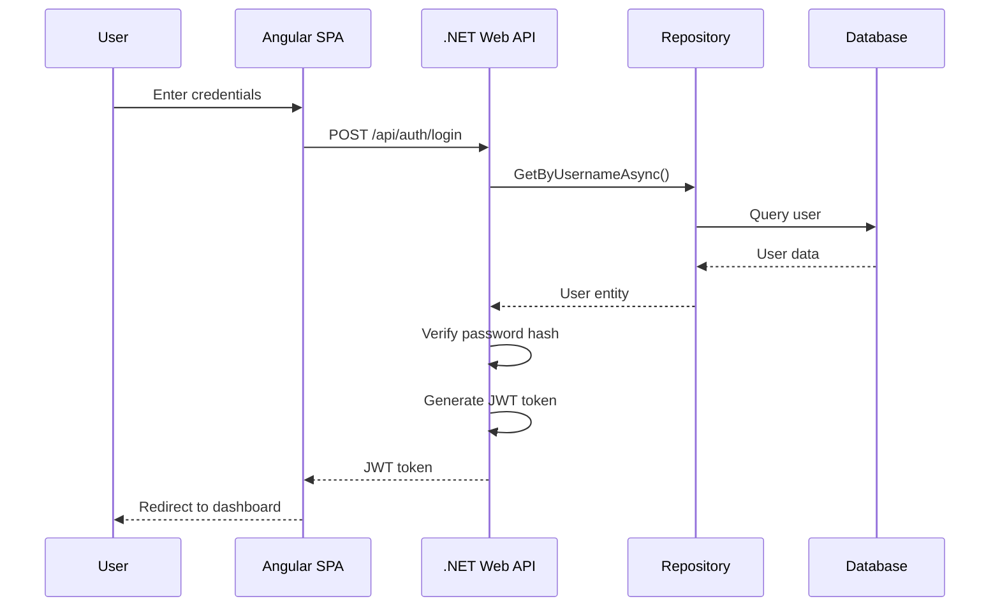
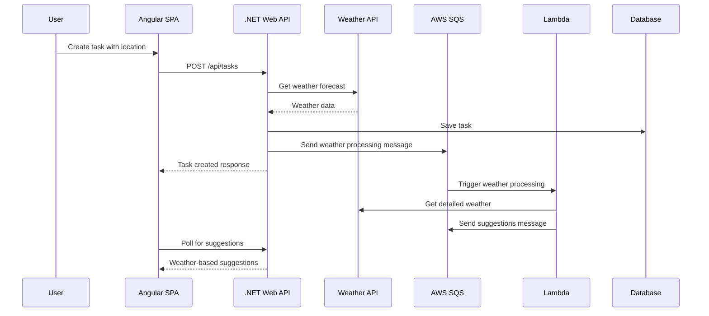

# ForecastFlow Architecture

## System Architecture Overview



## Component Details

### Frontend (Angular SPA)
- **Technology**: Angular 20.1, TypeScript, Angular Material
- **Responsibilities**: 
  - User interface and user experience
  - Client-side routing and state management
  - Form validation and user input handling
  - Authentication token management
- **Key Features**:
  - Responsive design for mobile and desktop
  - Real-time weather-aware task suggestions
  - Interactive task management dashboard

### Backend API (.NET Web API)
- **Technology**: .NET 8.0, ASP.NET Core Web API
- **Responsibilities**:
  - REST API endpoints for CRUD operations
  - JWT-based authentication and authorization
  - Business logic coordination
  - External API integration
- **Key Components**:
  - `AuthController`: User authentication and registration
  - `TasksController`: Task management operations
  - `UsersController`: User profile management

### Repository Layer
- **Pattern**: Repository pattern with dependency injection
- **Responsibilities**:
  - Data access abstraction
  - Database operation encapsulation
  - Unit of work implementation
- **Key Classes**:
  - `IAppUserRepository` / `AppUserRepository`
  - `IAppTaskRepository` / `AppTaskRepository`
  - `ApplicationDbContext` (Entity Framework)

### Core Domain Models
- **AppUser**: User entity with authentication details
- **AppTask**: Task entity with location and weather context
- **DTOs**: Data transfer objects for API communication

### Database (SQL Server)
- **Technology**: SQL Server with Entity Framework Core
- **Schema**:
  - Users table with authentication data
  - Tasks table with location and scheduling information
  - Foreign key relationships for data integrity

### External Integrations
- **OpenWeatherMap API**: Real-time weather data retrieval
- **AWS Services**: Cloud infrastructure and processing

## Data Flow

### User Registration/Login Flow


### Task Creation with Weather Integration Flow


## Security Architecture

### Authentication & Authorization
- **JWT Tokens**: Stateless authentication with configurable expiration
- **Password Security**: HMACSHA512 hashing with salt
- **HTTPS**: All communications encrypted in transit
- **CORS**: Configured for specific origins in production

### Data Protection
- **Input Validation**: Model validation and sanitization
- **SQL Injection Prevention**: Entity Framework parameterized queries
- **Secrets Management**: AWS Secrets Manager for production credentials
- **Environment Separation**: Different configurations for dev/staging/production

## Scalability & Performance

### Horizontal Scaling
- **Stateless API**: Can run multiple instances behind load balancer
- **Database Connection Pooling**: Efficient database resource utilization
- **CDN Distribution**: Static assets served via CloudFront

### Caching Strategy
- **Client-Side**: Angular HTTP interceptors for API response caching
- **Database**: Entity Framework query optimization and tracking
- **External API**: Rate limiting and response caching for weather data

### Asynchronous Processing
- **Lambda Functions**: Weather processing decoupled from main API
- **Message Queues**: SQS for reliable message delivery
- **Non-blocking Operations**: Async/await throughout the codebase

## Deployment Architecture

### Development Environment
```
Developer Machine → Local SQL Server/LocalDB → OpenWeatherMap API
```

### Production Environment (AWS)
```
CloudFront (CDN) → S3 (Static Assets)
                ↓
Application Load Balancer → ECS (API Containers)
                                    ↓
                              RDS (SQL Server)
                                    ↓
Lambda Functions ← SQS Queues ← API Events
        ↓
OpenWeatherMap API
```

## Technology Stack Summary

| Layer | Technology | Purpose |
|-------|------------|---------|
| Frontend | Angular 20.1, TypeScript, Angular Material | User interface and experience |
| API | .NET 8.0, ASP.NET Core Web API | RESTful service layer |
| Authentication | JWT, HMACSHA512 | Secure user authentication |
| Data Access | Entity Framework Core | ORM and database abstraction |
| Database | SQL Server | Data persistence |
| Cloud Functions | AWS Lambda (C#) | Serverless processing |
| Message Queue | AWS SQS | Asynchronous communication |
| Configuration | AWS Secrets Manager | Secure configuration management |
| Hosting | AWS ECS, S3, CloudFront | Scalable cloud hosting |
| Infrastructure | Terraform | Infrastructure as Code |
| External APIs | OpenWeatherMap | Weather data integration |

## Development Best Practices

### Code Organization
- **Clean Architecture**: Separation of concerns with clear boundaries
- **SOLID Principles**: Interface-based design and dependency injection
- **Repository Pattern**: Data access abstraction
- **DTO Pattern**: API data contracts separate from domain models

### Testing Strategy
- **Unit Tests**: Comprehensive coverage for business logic
- **Integration Tests**: Database and API endpoint testing
- **Mocking**: External dependencies isolated in tests
- **Continuous Testing**: Automated test execution in CI/CD

### Error Handling
- **Global Exception Handling**: Centralized error processing
- **Logging**: Structured logging with different levels
- **User-Friendly Messages**: Appropriate error responses for clients
- **Retry Logic**: Resilient external API calls